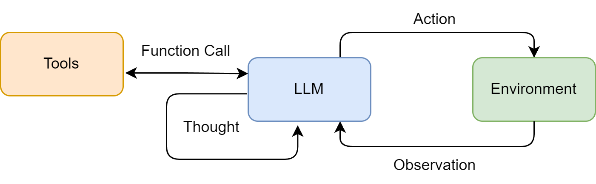

### 4.2.1 ReAct 的工作流程

在 ReAct 诞生之前，主流的方法可以分为两类：一类是“纯思考”型，如 **思维链（Chain-of-Thought）**，它能引导模型进行复杂的逻辑推理，但无法与外部世界交互，容易产生事实幻觉；另一类是“纯行动”型，模型直接输出要执行的动作，但缺乏规划和纠错能力。

ReAct 的巧妙之处在于，它认识到 **思考与行动是相辅相成的**。思考指导行动，而行动的结果又反过来修正思考。为此，ReAct 范式通过一种特殊的提示工程来引导模型，使其每一步的输出都遵循一个固定的轨迹：

- **Thought（思考）**：这是智能体的“内心独白”。它会分析当前情况、分解任务、制定下一步计划，或者反思上一步的结果。
- **Action（行动）**：这是智能体决定采取的具体动作，通常是调用一个外部工具，例如 `Search("华为最新款手机")`。
- **Observation（观察）**：这是执行 `Action` 后从外部工具返回的结果，例如搜索结果的摘要或 API 的返回值。

智能体将不断重复这个 **Thought → Action → Observation** 的循环，将新的观察结果追加到历史记录中，形成一个不断增长的上下文，直到它在 **Thought** 中认为已经找到了最终答案，然后输出结果。这个过程形成了一个强大的协同效应：**推理使得行动更具目的性，而行动则为推理提供了事实依据。**

我们可以将这个过程形式化地表达出来，如图 4.1 所示。具体来说，在每个时间步 $t$，智能体的策略（即大语言模型 $\pi$）会根据初始问题 $q$ 和之前所有步骤的“行动-观察”历史轨迹 $(a_1, o_1), \dots, (a_{t-1}, o_{t-1})$，来生成当前的思考 $h_t$ 和行动 $a_t$：

$$
(h_t, a_t) = \pi\big(q, (a_1, o_1), \dots, (a_{t-1}, o_{t-1})\big)
$$

随后，环境中的工具 $T$ 会执行行动 $a_t$，并返回一个新的观察结果 $o_t$：

$$
o_t = T(a_t)
$$

这个循环不断进行，将新的 $(a_t, o_t)$ 对追加到历史中，直到模型在思考 $h_t$ 中判断任务已完成。

---

**图 4.1 ReAct 范式中的“思考-行动-观察”协同循环**

---

这种机制特别适用于以下场景：

- **需要外部知识的任务**：如查询实时信息（天气、新闻、股价）、搜索专业领域的知识等。
- **需要精确计算的任务**：将数学问题交给计算器工具，避免 LLM 的计算错误。
- **需要与 API 交互的任务**：如操作数据库、调用某个服务的 API 来完成特定功能。

因此我们将构建一个具备使用外部工具能力的 ReAct 智能体，来回答一个大语言模型仅凭自身知识库无法直接回答的问题。例如：“华为最新的手机是哪一款？它的主要卖点是什么？”这个问题需要智能体理解自己需要上网搜索，调用工具搜索结果并总结答案。